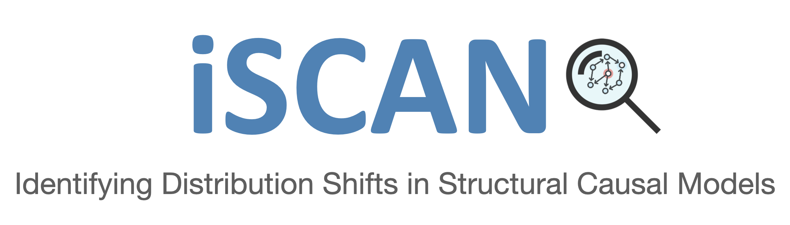

The `iscan-dag <https://pypi.org/project/iscan-dag/>`_ library is a Python 3 package designed for detecting which variables, 
if any, have undergo a casual mechanism shift **given multiple datasets**. 

iSCAN operates through a systematic process:

1. For each dataset, iSCAN initially evaluates at each sample the Hessian of the data distribution. 
This step is helpful in identifying the leaf variables (nodes) for all the datasets.
2. Subsequently, for the identified leaf variable, iSCAN evaluates at each sample the Hessian of the data distribution 
for the pooled data (resembling a mixture distribution). Then, based on the variance of the Hessian values, 
iSCAN determines if the given leaf node has undergone a mechanism shift (termed **shifted node**).

The steps above are applied iteratively, eliminating the identified leaf variable across all datasets at each iteration. 
See :py:func:`~iscan.shifted_nodes.est_node_shifts` for more details.

As an optional step, the library also includes a function to detect structural changes (termed **shifted edges**). 
As a by-product of detecting shifted nodes, iSCAN also estimates a topological ordering of the causal variables. 
Thus, allowing for the use of recent methods on variable (parents) selection. 
The current implementation of iSCAN employs  `FOCI <https://cran.r-project.org/web/packages/FOCI/index.html>`_  to identify 
the parent set of shifted nodes in each dataset. 
See :py:func:`~iscan.shifted_edges.est_struct_shifts` for more details.

.. important::

   If this library was useful in your research, please consider citing us. 

   [1] Chen T., Bello K., Aragam B., Ravikumar P. (2023). 
   `iSCAN: Identifying Causal Mechanism Shifts among Nonlinear Additive Noise Models. <https://arxiv.org/abs/2306.17361>`_
   Neural Information Processing Systems (NeurIPS).

   .. md-tab-set::

      .. md-tab-item:: BibTeX

         .. code-block:: latex

            @article{chen2023iscan,
               author = {Chen, Tianyu and Bello, Kevin and Aragam, Bryon and Ravikumar, Pradeep},
               title = {{iSCAN: Identifying Causal Mechanism Shifts among Nonlinear Additive Noise Models}},
               journal = {arXiv preprint arXiv:2306.17361},
               year = {2023}
            }

.. note::

   This project is under active development. If you encounter any issues, 
   please raise the issue in the `GitHub page <https://github.com/kevinsbello/iscan/issues>`_.

Features
--------

- Shifted nodes are detected without the need to estimate the DAG structure for each dataset.
- iSCAN is agnostic to the type of score's Jacobian estimator. 
The current implementation is based on a kernelized Stein's estimator. 
See :py:func:`~iscan.score_estimator.stein_hess` for details.
- iSCAN's time complexity is not influenced by the underlying graph density, and will run faster 
than methods such as DCI or UT-IGSP for large number of variables due to its omission of (non)parametric conditional independence tests.

A Quick Overview of iSCAN
-------------------------

We propose a new method for directly identifying changes (shifts) of causal mechanisms from multiple heterogeneous datasets, 
which are assumed to be originated by related structural causal models (SCMs) over the same set of variables. 

iSCAN considers that each **SCM belongs to the general class of nonlinear additive noise models** (ANMs), thus, 
generalizing prior work that assumed linear models. We assume that each dataset is generated from an interventional 
(observational if no variables are intervened) distribution of an underlying graph :math:`G^*`. See the figure below.

.. image:: https://github.com/kevinsbello/iscan/assets/6846921/ecebed13-8968-4a5e-a404-4b110b5eefd6
   :width: 1335
   :alt: iscan_model
   :align: center

In `[1] <https://arxiv.org/abs/2306.17361>`_, we prove that the Hessian of the log-density function of the **mixture distribution** reveals 
information about changes (shifts) in general non-parametric functional mechanisms for the leaf variables. 
Thus, allowing for the detection of shifted nodes. Our method leads to significant improvements in identifying shifted nodes.

**Theorem 1 (see `[1] <https://arxiv.org/abs/2306.17361>`_).** 
Let :math:`h` be the index of the environment (dataset), and :math:`p^h(x)` denote the pdf of the :math:`h`-th environment. 
Let :math:`q(x)` be the pdf of the mixture distribution of the all :math:`H` environments such that 
:math:`q(x) = \sum_h w_h p^h(x)`. Also, let :math:`s(x) = \nabla \log q(x)` be the associated score function. 
Then, under mild assumptions, if :math:`j` is a leaf variable in all environments, we have:

.. math::
   j \text{ is a shifted node } \iff  \text{Var}_{q}\left[ \frac{\partial s_j(X)}{\partial x_j} \right] > 0.

.. toctree::
   :caption: Home
   :hidden:

   Home<self>

.. toctree::
   :caption: Getting Started
   :hidden:

   usage

.. toctree::
   :caption: API Reference
   :hidden:
   :maxdepth: 2
   :titlesonly:

   api/iscan/index

